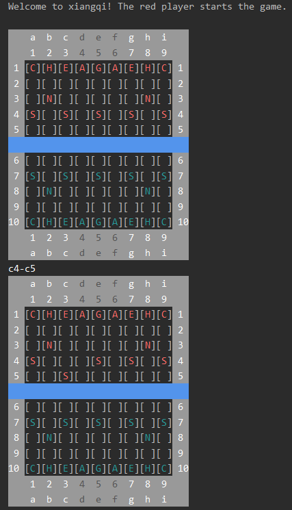
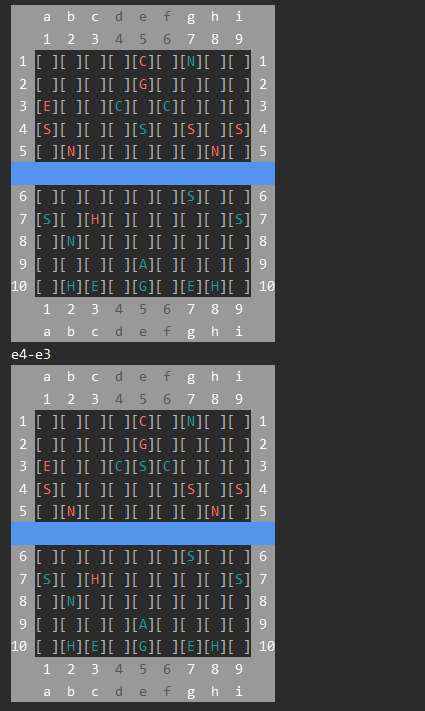

# Xiangqi Game

## Description
The program in XiangqiGame.py represents the playing of the board game [xiangqi](https://en.wikipedia.org/wiki/Xiangqi), also known as Chinese chess. *Xiangqi* is played between two players (one with red pieces and another with black pieces), who move their respective pieces around a board that is 9 lines wide and 10 lines long. In the course of the game, players typically capture opponent pieces and try to put the opponent's general piece in "check", meaning that the general could be captured in the next move. The ultimate objective of each player is to put the opponent's general into a situation where no matter what move the general may make, it cannot escape being in check. This situation is called "checkmate", and when it occurs, the player whose general is in checkmate loses the game and the other player wins.

## Installation
I used the PyCharm IDE to write, run, and test XiangqiGame.py. The following instructions are for meant for running the file on PyCharm in Windows.

1. Download XiangqiGame.py and extract the zip file into the directory of your choice.

2. Download and install the latest version of [Python](https://www.python.org/downloads/).

3. Download and install the latest version of the [PyCharm Community Edition](https://www.jetbrains.com/pycharm/download/#section=windows).

4. Run PyCharm, answer the set-up questions, and create a new project in the directory of your choice.

5. Click on the little arrow to the left of "Project Interpreter", click on "Existing Interpreter", and select the version of Python that you installed.

6. In the top toolbar, click on "File", and then "Open...". Select XiangqiGame.py from where you extracted the zip file into earlier.

7. The contents of XiangqiGame.py should now be displayed.

## Usage
To run the program, right-click on the file name in the tab header, and click "Run XiangqiGame". A complete sample game of *xiangqi* should now be displayed in the terminal. Please note that the sample game is not representative of a game played by serious players. It is only meant to show how valid moves are allowed, how invalid moves are disallowed, the various moves that can be made by the different pieces, and the eventual checkmate of the red general.

## Built With
* Python 3.8
* PyCharm Community Edition 2019.3.1

## Author
* Timothy Yoon

## Credits
* Project idea and specifications courtesy of Oregon State University's Winter 2020 CS 162 course.
* Most of the installation instructions above courtesy of CS 161's PyCharm set-up tutorial.
